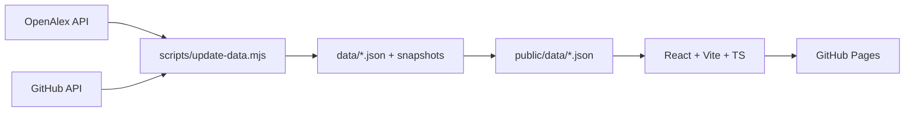

# Paper & OSS Ranking

<p align="center">
  <a href="https://rsasaki0109.github.io/paper-oss-ranking/">
    
  </a>
</p>

<p align="center">
  <a href="https://rsasaki0109.github.io/paper-oss-ranking/"></a>
  <a href="https://github.com/rsasaki0109/paper-oss-ranking/actions/workflows/deploy.yml"></a>
  <a href="https://github.com/rsasaki0109/paper-oss-ranking/actions/workflows/data-update.yml"></a>
  <a href="LICENSE"></a>
</p>

<p align="center">
  <strong>Paper & OSS rankings by citations and GitHub stars.</strong><br>
  <a href="https://rsasaki0109.github.io/paper-oss-ranking/">🚀 Live Demo</a>
</p>

## Screenshot

> TODO: add `docs/screenshot.png` after the first Pages deploy.

| Papers                                                                                        | OSS                                                                        | Paper + OSS                                                                   | Trending                                                                  |
| --------------------------------------------------------------------------------------------- | -------------------------------------------------------------------------- | ----------------------------------------------------------------------------- | ------------------------------------------------------------------------- |
| Papers ranked by OpenAlex citation counts, with search, category/year filters and +30d growth | Repos ranked by GitHub stars, with search, category filter and +30d growth | Human-curated paper↔repo mapping with “highly cited, fewer stars” style views | Top citation/star movers over 7 / 30 / 90 days (N/A until history exists) |

## Features

- **Papers view**: rank, title, authors, year, venue, category, citations, citation growth, paper URL, official repo link; sort by citations / growth / year; search + category + year filters.
- **OSS view**: rank, repo, description, stars, forks, language, category, last updated, contributors count, related paper; sort by stars / growth / recently updated; search + category filter.
- **Paper + OSS view**: curated join (no auto-guessing), plus descriptive rankings: highly cited & fewer stars, highly starred & fewer citations, fastest-growing papers/OSS. Citations and stars are always shown independently — never merged into a mystery score.
- **Trending view**: +7d / +30d / +90d movers computed from daily snapshots; honest `N/A` when history is missing.
- Responsive tables, dark mode, SEO meta + OG tags + favicon, `Last updated` + data-source labels in the header.

## Data sources

- Paper data: [OpenAlex](https://openalex.org/) API (primary) with [Semantic Scholar](https://www.semanticscholar.org/) API fallback (no Google Scholar scraping).
- OSS data: GitHub REST API (uses `GITHUB_TOKEN` in Actions).

## Architecture

No backend, no database. GitHub Actions fetches data daily and commits static JSON; the React frontend reads that JSON.



- `data/papers.json`, `data/repos.json`: curated entity lists + cached API values.
- `data/links.yaml`: human-maintained paper↔repo mapping (`official` / `community`).
- `data/snapshots/YYYY-MM-DD.json`: daily `{ citations, stars }` values; `public/data/history.json` aggregates them for growth math.
- `public/data/meta.json`: `{ last_updated, paper_source, oss_source }` shown in the header.

## Directory structure

```text
paper-oss-ranking/
├── data/                  # source of truth: papers.json, repos.json, links.yaml, snapshots/, meta.json
├── public/data/           # generated artifacts served by the site (do not hand-edit)
├── scripts/               # update-data.mjs, build-data.mjs, validate.mjs, lib.mjs
├── src/                   # React frontend (lib/, components/, App.tsx)
├── .github/workflows/     # data-update.yml (daily), deploy.yml (Pages)
├── .github/ISSUE_TEMPLATE/# add-paper / add-oss / fix-mapping
├── docs/                  # banner.svg and other static docs assets
└── index.html, vite.config.ts, package.json
```

## Local development

Prerequisites: Node.js 18+.

```bash
npm install
npm run update-data   # fetch real citation/star counts (needs network; GITHUB_TOKEN optional but recommended)
npm run dev           # http://localhost:5173/paper-oss-ranking/
npm run lint
npm run test
npm run build         # typecheck + vite build + offline public/data refresh
npm run preview
```

`npm run build` never calls external APIs; it only rebuilds `public/data` from `data/`.

## GitHub Pages deployment

1. Rename the default branch to `main` if needed and push.
2. In repo **Settings → Pages**, set **Source** to **GitHub Actions**.
3. Push to `main` (or run the Deploy workflow manually). The `deploy.yml` workflow runs lint → test → build → deploy.
4. The site is served at `https://<username>.github.io/paper-oss-ranking/`. `vite.config.ts` sets `base: "/paper-oss-ranking/"` and all data fetches use `import.meta.env.BASE_URL`, so assets and JSON resolve under the subpath.

## Data update mechanism

- Workflow `.github/workflows/data-update.yml` runs daily (`17 2 * * *` UTC) and on manual dispatch.
- `scripts/update-data.mjs` fetches OpenAlex (by DOI, falling back to title search) and GitHub (`/repos/{full_name}` + contributors count), updates only fields with valid API responses, writes `data/snapshots/YYYY-MM-DD.json`, regenerates `public/data/*`, validates the schema, and commits **only if something changed**. API failures never destroy existing good data.
- If OpenAlex is rate-limited, the updater falls back to the Semantic Scholar API for papers. Title-search hits must pass a word-overlap relevance gate, otherwise values stay blank (`N/A` in the UI) until a later run resolves them — counts are never guessed.
- Bot pushes use `GITHUB_TOKEN` and therefore don't trigger `push` workflows; `deploy.yml` additionally listens for `workflow_run` completion of Data Update so fresh data is redeployed daily without any PAT.
- No secrets are required: the workflow uses the built-in `GITHUB_TOKEN`. For heavy local use, export `GITHUB_TOKEN` to raise the GitHub rate limit; optionally `OPENALEX_MAILTO` for the OpenAlex polite pool and `SEMANTIC_SCHOLAR_API_KEY` to raise fallback limits.

## How to add a paper

1. Find the paper's DOI (preferred) or OpenAlex ID.
2. Add an entry to `data/papers.json` (copy an existing one; set counts to `null` — the updater will fill them in; never hard-code citation numbers).
3. Run `node scripts/validate.mjs`, or open a PR — CI validates the schema. Or use the **Add Paper** issue template.

## How to add an OSS project

1. Confirm the exact `owner/repo` on GitHub.
2. Add an entry to `data/repos.json` with `stars: null` etc. (the updater fills them in).
3. Validate and open a PR, or use the **Add OSS** issue template.

## How to link a paper and repository

Edit `data/links.yaml`:

```yaml
- paper: 10.1109/tro.2017.2705103 # DOI (lowercase) or OpenAlex ID from papers.json
  repo: raulmur/ORB_SLAM2 # full name from repos.json
  relation: official # official | community
```

Title-based auto-matching is intentionally not implemented — mappings are human-curated only.

## Contributing

See [CONTRIBUTING.md](CONTRIBUTING.md). Data-only PRs (papers/repos/links) are welcome and need no frontend changes.

## Known limitations

- Citation/star counts are `null` until the first successful API fetch; growth columns show `N/A` until ≥2 snapshots exist (so +90d takes ~3 months to become meaningful).
- Some OpenAlex records (e.g. arXiv versions) split citations across work IDs; counts reflect the single resolved record.
- Unauthenticated GitHub API calls are rate-limited (60 req/h); the daily workflow uses `GITHUB_TOKEN` (5,000 req/h).
- `danijar/dreamer` and similar umbrella repos may undercount project popularity split across successor repos.

## License

MIT — see [LICENSE](LICENSE).
